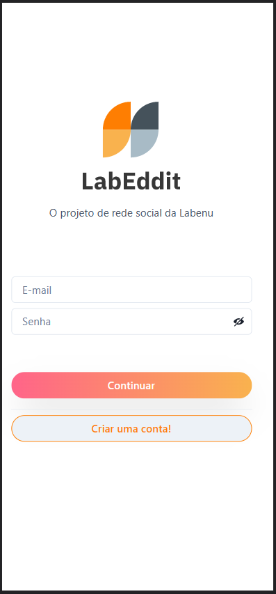
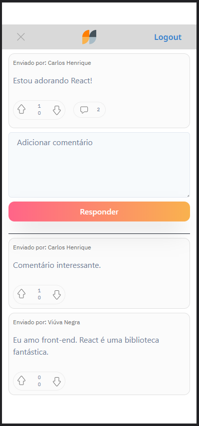

# Projeto Labeddit Frontend


<br>
Labeddit é uma rede social onde você pode postar mensagens, responder as tanto as suas mensagens quanto dos seus amigos. Além disso, se gostar da mensagem ou comentário, você pode curtir, entretanto, se não gostar do comentário, pode descurtir a mensagem mostrando seu descontentamento.
Projeto de conclusão do curso de programação web fullstack com produção do backend utilizando typescript de Front end com utilização do React e suas bibliotecas.

## Índice
- <a href="#funcionalidades">Funcionalidades do Projeto</a>
- <a href="#layout">Layout</a>
- <a href="#api">Banco de dados e API</a>
- <a href="#rodar">Como rodar esse projeto</a>
- <a href="#tecnologias">Tecnologias utilizadas</a>
- <a href="#autoras">Pessoas autoras</a>
- <a href="#passos">Próximos passos</a>

## Funcionalidades

- [x] Criação de usuário com senha
- [x] Login de usuário já cadastrado
- [x] Criação de post
- [x] Reação dos usuários ao post
- [x] Criação de resposta ao post
- [x] Reação dos usuários à resposta

## Layout






## Banco de dados e API

https://github.com/Casenrique/projeto-labeddit-backend


## Demonstração
[Link Demonstração](https://projeto-labeddit-frontend.vercel.app/)

## Como rodar esse projeto

```bash
# Clone esse repositório
$ git clone linkrepo

# Acesse a pasta do projeto no seu terminal
$ cd nome-do-projeto

# Instale as dependências
$ npm install

# Execute a aplicação
$ npm start

# A aplicação será iniciada na porta 3000, acesse pelo navegador:
http://localhost:3000
```

## Tecnologias utilizadas

1. [React](https://reactjs.org/)
2. [React Router](https://reactrouter.com/en/main)
3. [React Context ](https://reactjs.org/docs/context.html)
4. [Axios](https://axios-http.com/ptbr/docs/intro)
5. [Styled-components](https://styled-components.com/)
6. [Chakra-UI](https://chakra-ui.com/)

## Pessoas Autoras


[Linkedin](https://www.linkedin.com/in/carlos-henrique-de-souza-1767311a/)

## Próximos passos

- [ ] Adicionar funcionalidade de reset de senha
- [ ] Melhorar estilização da função like e dislike


